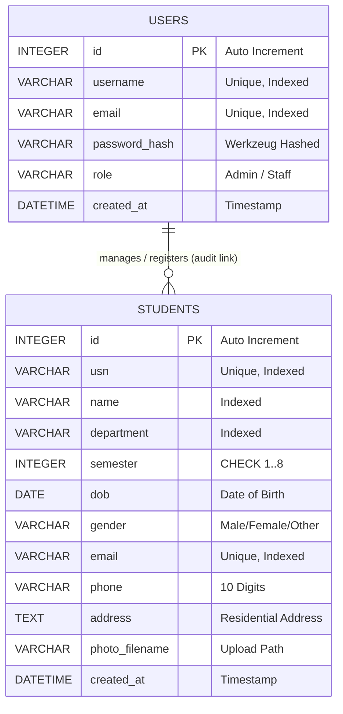

# Entity Relationship (ER) Diagram & Database Specification

## 1. Overview
The Student Management System database consists of two core relational entities: `users` and `students`. The schema is normalized (3NF) to ensure data integrity, eliminate redundancy, and maintain performance during query execution.

---

## 2. Mermaid ER Diagram

---

## 3. Data Dictionary

### 3.1 Users Table (`users`)
| Column Name | Data Type | Constraints | Description |
| :--- | :--- | :--- | :--- |
| `id` | `INTEGER` | `PRIMARY KEY AUTOINCREMENT` | Unique identifier for portal user |
| `username` | `VARCHAR(50)` | `NOT NULL, UNIQUE, INDEX` | Unique login username |
| `email` | `VARCHAR(120)` | `NOT NULL, UNIQUE, INDEX` | User email address |
| `password_hash` | `VARCHAR(256)` | `NOT NULL` | Werkzeug PBKDF2/SHA256 password hash |
| `role` | `VARCHAR(20)` | `NOT NULL, DEFAULT 'Staff'` | Role authorization ('Admin' or 'Staff') |
| `created_at` | `DATETIME` | `DEFAULT CURRENT_TIMESTAMP` | Timestamp of account registration |

### 3.2 Students Table (`students`)
| Column Name | Data Type | Constraints | Description |
| :--- | :--- | :--- | :--- |
| `id` | `INTEGER` | `PRIMARY KEY AUTOINCREMENT` | Primary key |
| `usn` | `VARCHAR(20)` | `NOT NULL, UNIQUE, INDEX` | University Seat Number / Roll Number |
| `name` | `VARCHAR(100)` | `NOT NULL, INDEX` | Student Full Name |
| `department` | `VARCHAR(100)` | `NOT NULL, INDEX` | Academic Department Name |
| `semester` | `INTEGER` | `NOT NULL, CHECK (1..8)` | Current Academic Semester |
| `dob` | `DATE` | `NOT NULL` | Date of Birth |
| `gender` | `VARCHAR(10)` | `NOT NULL` | Gender ('Male', 'Female', 'Other') |
| `email` | `VARCHAR(120)` | `NOT NULL, UNIQUE, INDEX` | Student personal email |
| `phone` | `VARCHAR(20)` | `NOT NULL` | 10-digit primary phone contact |
| `address` | `TEXT` | `NOT NULL` | Complete residential address |
| `photo_filename` | `VARCHAR(255)` | `DEFAULT 'default_avatar.png'` | Saved photo filename |
| `created_at` | `DATETIME` | `DEFAULT CURRENT_TIMESTAMP` | Timestamp of student registration |

---

## 4. Indexing & Optimization Strategy
- **Primary Indexes**: `users(id)` and `students(id)` automatically indexed via `B-Tree`.
- **Search Indexes**: `students(usn)`, `students(name)`, `students(department)`, and `students(email)` are explicitly indexed to optimize multi-field search and pagination queries.
- **Uniqueness Enforcement**: Unique constraints on `users.username`, `users.email`, `students.usn`, and `students.email` prevent duplicate records at the database level.
